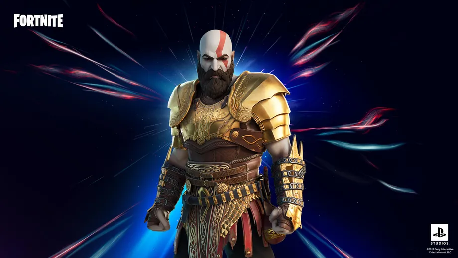
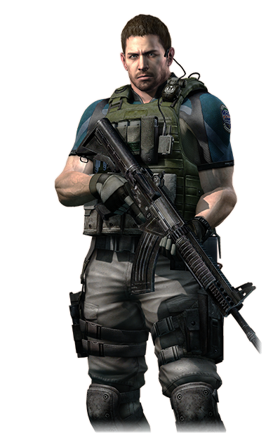

# JAVASCRIPT SYNTAX PORTFOLIO PROJECT CODEACADEMY #

## Mixed Messages ##

### Introduction ##

The goal of the project is to create a program that outputs a random message each time. The technologies used for this project are:

+ JavaScript ES6

### Theme: Which Video Game Character are You? ###

The theme of the project will be inspired by video game characters. Each time the user runs the program, the output will be the video game character that represents them, the signature line of the video game character, and a message of personalized to that video game character.

